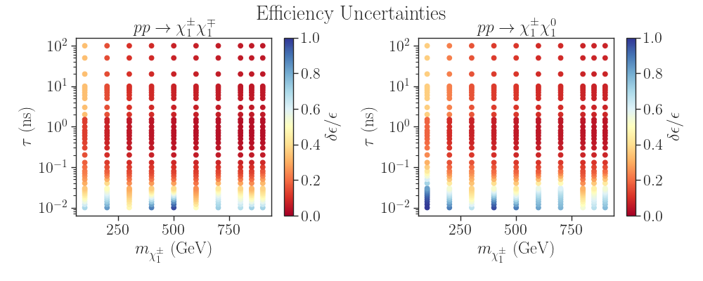
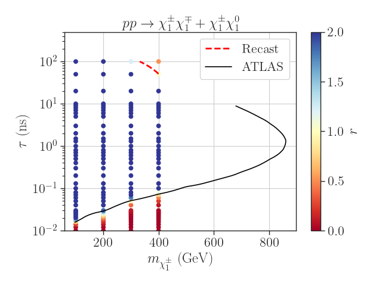

# Validation

The results for the Wino scenario used for validating the recasting code can be found in the files:
* [C1C1_effs.json](C1C1_effs.json): overall search efficiencies for chargino pair production
* [C1N1_effs.json](C1N1_effs.json): overall search efficiencies for chargino-neutralino associated production


## Computing efficiencies

These efficiencies can be reproduced through the following steps:

1. Generate events running (in the top folder):
   ```
   ./runScanMG5.py -p validation/scan_parameters_wino_chgchg.ini
   ```
   and
   ```
   ./runScanMG5.py -p validation/scan_parameters_wino_chgn1.ini
   ```
   The events (Delphes/ROOT files) will be stored in the `pp2chgchg` and `pp2chgn1` folders for several chargino masses and lifetimes.
   The cards for the event generation ([Cards](./Cards)) and other options for event generation are defined in the `scan_parameters_wino_xx.ini` files.

2. Compute efficiencies running:
   ```
   ./computeEfficiencies.py -i pp2chgchg/Events -l 1000024 -tauF tau_list.csv
   ```
   and
   ```
   ./computeEfficiencies.py -i pp2chgn1/Events -l 1000024 -tauF tau_list.csv
   ``` 
   The final efficiencies are stored in .json files in the event folders.

3. Collect the results running:
   ```
   ./collectData.py -i pp2chgchg/Events -o C1C1_effs.json
   ```
   and
   ```
   ./collectData.py -i pp2chgn1/Events -o C1N1_effs.json
   ```
   The combined efficiencies are finally stored in the `C1C1_effs.json` and `C1N1_effs.json` files.


## Plotting the exclusion curve

After computing the efficiencies the Jupyter notebook [plotEffs.ipynb](plotEffs.ipynb) shows an example of how to
analyse them. For instance the MC uncertainties (using 50k events) are shown below[^1]:




The [plotExclusion.ipynb](plotExclusion.ipynb) shows how to obtain the exclusion curve.
Below is a comparison between the exclusion curve obtained for the Wino scenario using the recasting code and the official ATLAS exclusion. *Note that ATLAS uses a model dependent approach which results in slightly stronger limits.*




[^1]: The efficiencies for very small lifetime suffers from large uncertainties.
For such small lifetimes the charginos only decay within the tracker if they have a large boost (or large pT).
Therefore only the tail of the pT distribution produces sizeable efficiencies, thus resulting in large uncertainties.
A way to increase the precision at small lifetimes is to use a weight bias when generating events with MadGraph so the tail of the pT distribution is better described (i.e. has more MC events).
In this case, however, care must be taken to unweight the biased events when computing the efficiencies.
