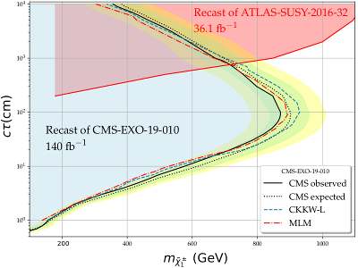

# CMS Disappearing Track run 2 searches #

## CMS-EXO-19-010 [arXiv:2004.05153](https://arxiv.org/abs/2004.05153), HEPData: [1790827](https://www.hepdata.net/record/ins1790827) ##

## CMS-EXO-16-044 [arXiv:1804.07321](https://arxiv.org/abs/1804.07321), HEPData: [1669245](https://www.hepdata.net/record/ins1669245) ##

Together these make up 140 inverse femtobarns of run 2 data.


## Author: ##

[Mark Goodsell](mailto:goodsell@lpthe.jussieu.fr)

## Description ##

This repository holds the code for recasting the above searches corresponding to v1 of "HackAnalysis" along with validation material and auxiliary scripts. 


## Prerequisites ##

 Needed are:

* A recent version of [Pythia 8](https://pythia.org/) (8.303 and newer)
* [FastJet](http://fastjet.fr/)
* [HepMC2](https://hepmc.web.cern.ch/hepmc/) e.g. [v2.06.11](https://hepmc.web.cern.ch/hepmc/releases/hepmc2.06.11.tgz), built with 
* [YODA](https://yoda.hepforge.org) (for producing histograms). The code also uses the YAML reader embedded within YODA. 
* Standard libraries (e.g zlib)

For HEPMC we need length to be mm and energy in GeV, so e.g. for 2.06.10:

```
cd hepmc-2.06.10
mkdir build
cd build
cmake -Dmomentum:STRING=GEV -Dlength:STRING=CM ..
```

Some code has been taken/modified from the following:

* HEPUtils and a little from MCUtils by [Andy Buckley](http://www.ppe.gla.ac.uk/~abuckley/)
* Some small parts from the ATLAS HSCP code by Andre Lessa. 
* (A very small amount from) [GAMBIT](https://gambit.hepforge.org)

## Installation

Within the installation directory,  edit the following lines at the top of the Makefile:

```
hepmcpath=
pythia8path=
fastjetpath=

YODApath=
#### Here a subtlety, need e.g.:
#### YAMLpath=<where your YODA code is>/YODA-1.8.5/src/yamlcpp
YAMLpath=
```

If in any doubt about the YAMLpath, just look for where the directory src/yamlcpp is located within your YODA installation. 

Then the code can be compiled with

```
make
```

which will produce the executables 

```
analysePYTHIA.exe, analysePYTHIA_LHE.exe, analyseHEPMC.exe
```

They can of course also be built separately. If you want to disable HEPMC (or you cannot install it) then you can skip that executable but you will also need to remove reference to the headers in the code. Similarly fastjet could equivalently (as the code currently runs) be replaced with fjcore with some small modifications, but if you want to trial e.g. pileup subtraction you need the full fastjet.

To test that the installation has succeeded, run the basic executable:

```
cd InputFiles
../analysePYTHIA.exe LOpythia.yaml
```

This will generate 1000 events for winos of 700 GeV and decay lenght 1000cm (as specified in the LOpythia.yaml file) and will produce LO.yoda, LO.eff and LO_cf.eff as outputs. You can then check that the results are sensible by executing the limits script:

```
python3 ../Scripts/CLs_DTandHSCP.py LO.eff
```

which should tell you that the point is challenged by both the DT_CMS analysis (CLs limit ~0.93) and excluded by the HSCP_ATLAS analysis (CLs limit ~0.999). See below for more about this script.

## Running ##

Each of the three executables takes a YAML file as input in place of a load of settings. Examples are provided in the InputFiles subdirectory, so they can be launched by

```
./analysePYTHIA_LHE.exe myinput.yaml
```

The exception is the analyseHEPMC.exe which can *also* accept just the hepmc filename, e.g.:

```
./analyseHEPMC.exe unweighted_events.hepmc.gz
```

In this case the code runs with default options.

### Mode 1: analysePYTHIA.exe ###

This file will run leading order event generation within pythia, so requires a configuration file according to the standard pythia settings. It can run with multiple cores so is rather fast. However I have not included validation of this because it cannot accurately simulate the MET distribution, but it is the fastest way to test that things are running.

### Mode 2: analysePYTHIA_LHE.exe ###

This file requires Les Houches Event files (e.g. from MadGraph) split into one chunk per core. This can be done with the provided splitlhe.py:

```
python splitlhe.py --ncores=4 <path-to-lhe-file> 
```

The file can be either compressed or uncompressed. The output will be a number of compressed files put into the subdirectory "Split" from where it is run labelled "Split/split_0.lhe.gz", "Split/split_1.lhe.gz", ... which can then be read by the main executable. In this case the YAML file looks like e.g.

```
---
analyses:
 - DT_CMS
 
settings:
  nevents: 150000
  cores: 15
  Include Pileup: true
  Efficiency Filename: CKKWL.eff
  Cutflow Filename: CKKWL_cf.eff
  Histogram Filename: CKKWL.yoda
  LHE file: Split/split
  Config file: CKKWL.cfg
```

Here we need a configuration file for pythia with any setting for the showering. Since the events should be generated with up to two additional partons to (more) accurately simulate the MET and pT distributions, sample configurations are provided for MLM and CKKW-L matching/merging. 

Note that the matching/merging scale -- as in MadGraph -- needs to be set appropriately to the hard process being simulated. This is specified withing the .cfg files for pythia.

### Mode 3: analyseHEPMC.exe

This executable requires a hepmc v2 file as input, either uncompressed -- or compressed. This is especially intended for events simulated and showered within MadGraph. This can only function in single core mode (as it can only read one event at a time from the file ...) but then comes with no special settings, e.g.:

```
---
analyses:
 - DT_CMS
 
settings:
  nevents: 150000
  cores: 1
  Include Pileup: false
  Efficiency Filename: HEPMC.eff
  Cutflow Filename: HEPMC_cf.eff
  Histogram Filename: HEPMC.yoda
```

This is probably the simplest way to run the program, but is relatively slow due to the file manipulations and lack of multicore running (presumably putting the hepmc events into a fifo would be faster). 

## Pileup ##

The code is able to include the effect of pileup, even if it does not appear important for this analysis. The default pileup filename is minbias.dat.gz which should be in the directory from which the file is launched; to generate this some code is provided in the GeneratePileup directory. 

## Output ##

The code writes an "efficiency file" which is an SLHA-style format with information about the cross-section and efficiencies of each cut; a "cutflow file" which is a rather verbose textfile with information about the cutflows; and a YODA file with the booked histograms.

A script provided can be used with the efficiency file to calculate limits:

```
python3 CLs_DTandHSCP.py efficiencyfile.eff [cross-section]
```

where the cross-section is optional. In the PYTHIA running modes the cross-section is taken from pythia and written into the efficiency file. However, you may want to use NLO-NLL values from elsewhere, in which case the option is useful. Moreover, in HEPMC mode the cross-section is not provided at all so it must be specified by the user. In the case of running from madgraph these can be found in the 

```
tag_XX_merged_xsecs.txt
```

file. Note that the output of the limit script will give a description of the merged regions, and the final lines should be like 

```
Analysis: DT_CMS, Best region: 2, Best CLs limit: 0.929, Upper cross-section limit: 1.054e+01 fb
Analysis: HSCP_ATLAS, Best region: 4, Best CLs limit: 0.999, Upper cross-section limit: 3.257e+00 fb
```

By "CLs limit" we really mean 1-CLs; values above 0.95 are excluded at 95% confidence level.


## Validation ##

Validation material in the form of cutflows and plots of MET/pT are provided. 

Here is a reproduction of the CMS exclusion plot:



We see a rather good agreement over the whole range, especially given the uncertainties which can be seen by the different matching/merging methods. 

## Thanks ##

Thanks go to:

* Lakshmi Priya for collaboration on this analysis (and the related paper) for more than a year!
* Brian Francis of CMS for *many* helpful comments and discussions.
* Jack Araz, Benjamin Fuks and Manuel Utsch for collaboration on closely related topics in the context of MadAnalysis!
* Sabine Kraml and Andre Lessa for discussions about the acceptances.

## Licence ##

Having borrowed code from elsewhere it is only reasonable that this code can be reused/repurposed by anyone who finds it useful -- provided that they credit its origin!

It is therefore understood to be released under the GNU GENERAL PUBLIC LICENSE v3 (as required by the corresponding licence of heputils).

