# Validation of CalRatio Recast ([ATLAS-EXOT-2019-23](https://atlas.web.cern.ch/Atlas/GROUPS/PHYSICS/PAPERS/EXOT-2019-23/))

The recast code and results are based on [arXiv:2412.13976](https://arxiv.org/pdf/2412.13976) and the auxiliary material
provied in [HepDATA](https://www.hepdata.net/record/ins2043503).

All the Cards used for the event generation can be found in [Cards](./Cards).

The results below were obtaining using the Method 2 described [here](../README.md) and the [plotEfficiencies](../plotEfficiencies.py) code.

 * $m_{\Phi} = 125$ GeV and $m_S = 55$ GeV:

 

     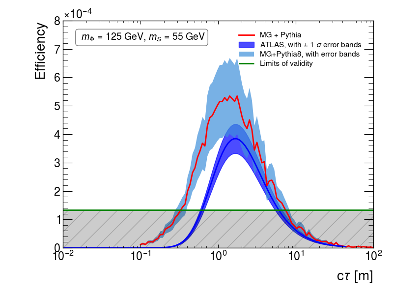
     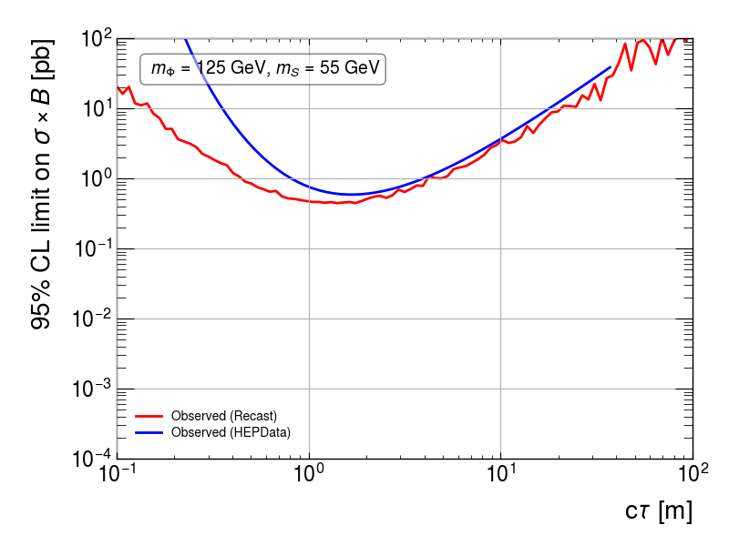
 

 * $m_{\Phi} = 200$ GeV and $m_S = 50$ GeV:

 

     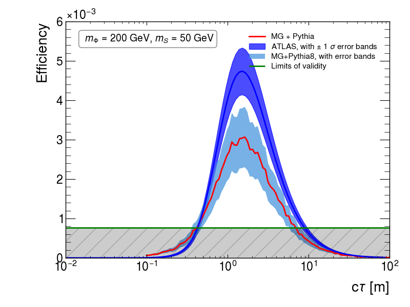
     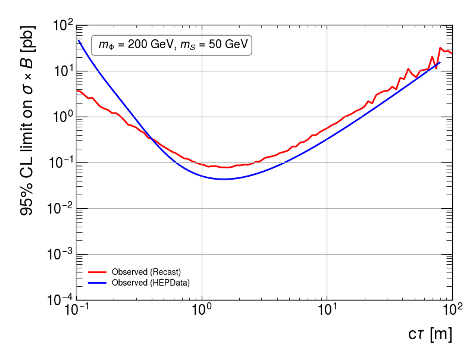
 

 * $m_{\Phi} = 400$ GeV and $m_S = 100$ GeV:

 

     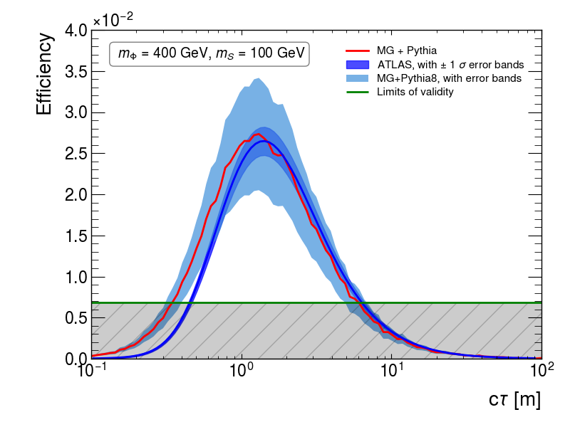
     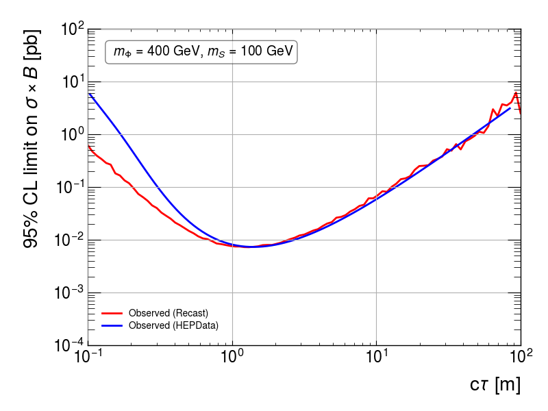
 

  * $m_{\Phi} = 600$ GeV and $m_S = 150$ GeV:

 

     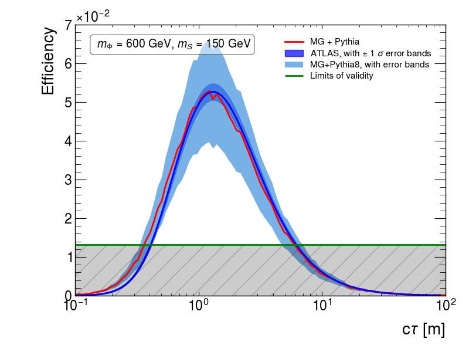
     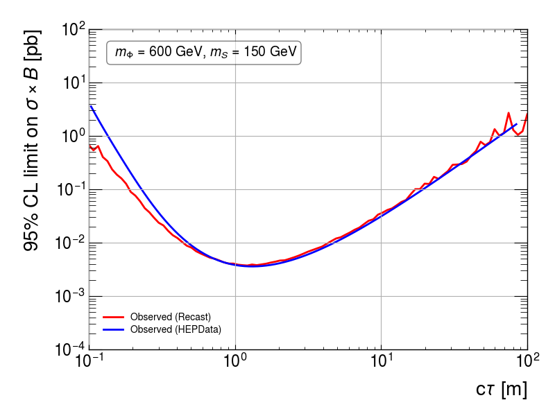
 

 * $m_{\Phi} = 1$ TeV and $m_S = 275$ GeV:

 

     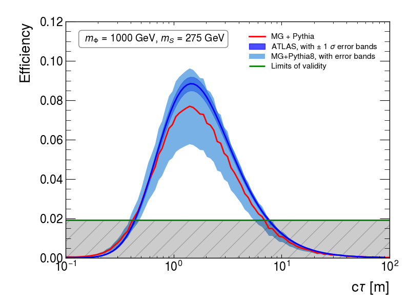
     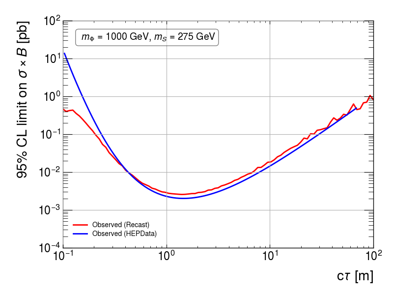
 

 

 * $m_{\Phi} = 1$ TeV and $m_S = 475$ GeV:

 
 

     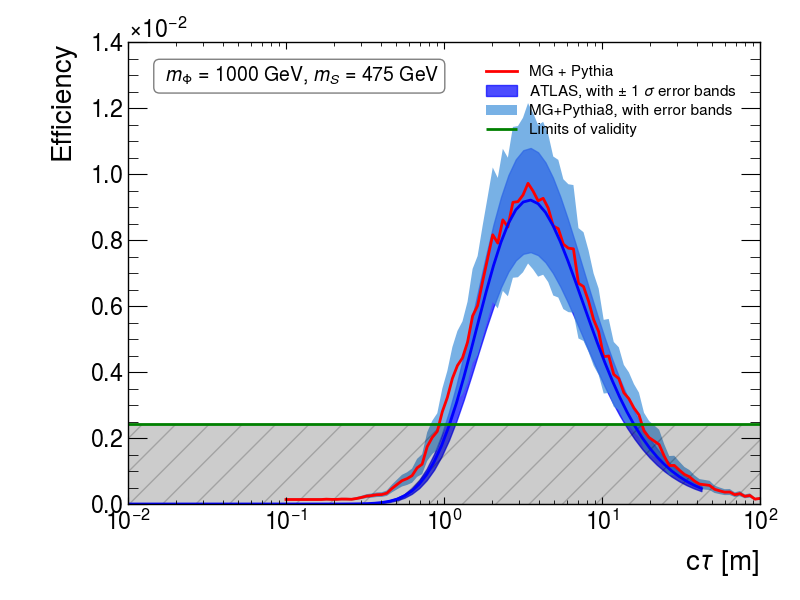
     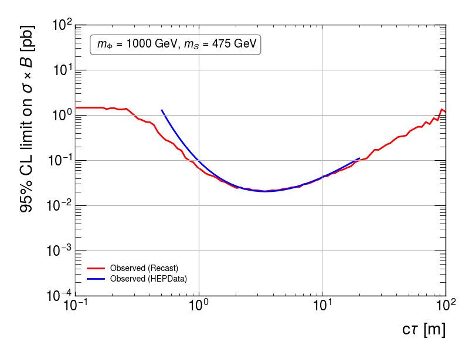
 
