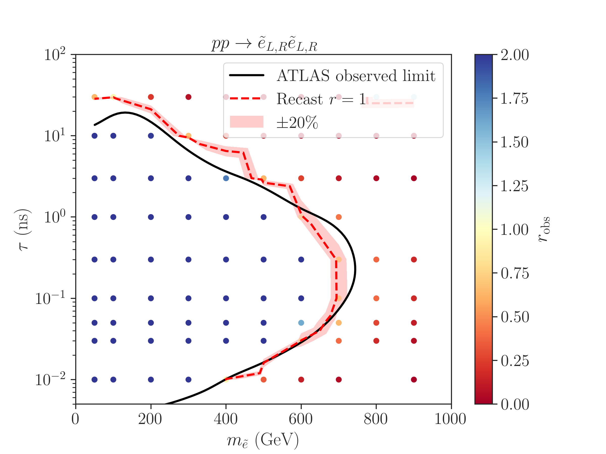

# Displaced Lepton Recast ([ATLAS-SUSY-2018-14](https://atlas.web.cern.ch/Atlas/GROUPS/PHYSICS/PAPERS/SUSY-2018-14/))


## Authors: ##
[Andre Lessa](mailto:lessa.a.p@gmail.com)

The recast code and results are based on the auxiliary material provided in [ATLAS-SUSY-2018-14](https://atlas.web.cern.ch/Atlas/GROUPS/PHYSICS/PAPERS/SUSY-2018-14/).
The parametrized efficiencies provided in [Figure 19a](https://atlas.web.cern.ch/Atlas/GROUPS/PHYSICS/PAPERS/SUSY-2018-14/figaux_19a.png) and [Figure 19b](https://atlas.web.cern.ch/Atlas/GROUPS/PHYSICS/PAPERS/SUSY-2018-14/figaux_19b.png) are applied to truth-level leptons to reproduce the analysis reconstruction efficiency.

Validation of the results can be found in the [validation folder](./validation).

## Pre-Requisites and Installation ##

The following pre-requisites must be installed before running the main code:

  * [DelphesLLP](https://github.com/llprecasting/recastingCodes/tree/main/Delphes_LLP)
  * [pyROOT](https://root.cern.ch/)
  * [Spey](https://github.com/SpeysideHEP/spey), [Spey-Pyhf plugin](https://github.com/SpeysideHEP/spey-pyhf) and [Pyhf](https://github.com/scikit-hep/pyhf) (required for computing upper limits using Pyhf)

It might also be necessary to set environment variables, so the required libraries can be found (see [setenv.sh](./setenv.sh)).

An installation script ([installer.sh](./installer.sh)) is provided, which will try to install [MadGraph5](https://launchpad.net/mg5amcnlo) and [DelphesLLP](https://github.com/llprecasting/recastingCodes/tree/main/Delphes_LLP).
A ROOT installation must already be present in the system.

**Note**: *It is not a given that the installation script will work for all systems. Also, the MadGraph version may have to be updated. Nonetheless, it may serve as a guide for a manual installation.*

## Running the recast code


### Generating Input Files

For running the recast code or reproducing the results in the [validation folder](./validation/) one must first:

 1. Generate HepMC events with MadGraph5 plus Pythia8.
 2. Run Delphes on the HepMC events using a [modified version of Delphes](https://github.com/llprecasting/recastingCodes/tree/main/Delphes_LLP), which stores LLPs and their decays in the output ROOT file. **The PDG codes of the LLP(s) need to explicitly defined in the BSMFilter module of the delphes card**. See [delphes_card_slepton.dat](validation/Cards/delphes_card_slepton.dat) for an example where the LLPs are sleptons and have PDG codes `1000011-1000013` and `1000011-2000013`.

 Note that Delphes is used for extracting the required (truth-level) event information and storing it in a compact (ROOT file) format.
 The Delphes detector simulation modules are not used.

Examples of cards for generating events for the long-lived slepton model can be found in the [validation/Cards](./validation/Cards/) folder.

#### Running a scan over model space

A scan script [runScanMG5.py](./runScanMG5.py) is provided for running the MG5+Pythia8+DelphesLLP pipeline over a set of model parameters. The output is a set of Delphes/ROOT files containing the minimal information required for
computing the efficiencies.
The usage of the scan code is:


```
./runScanMG5.py -p <parameters_file>
```

where the parameter defines all the necessary input and options. Examples of parameter files can be found [here](./validation/scan_parameters_ee.ini) for generating events for selectron pair production.


### Computing efficiencies

After generating ROOT file(s) using the modified Delphes code (see above),  the efficiencies can be computed running:

```
./computeEfficiencies.py -i <input> -l <LLP PDG> -n <number of parallel jobs> -v <verbose>
```

The options include:

*  `-h` or `--help` : show the help message and exit
*  `-i` or `--input` : Path to Delphes ROOT file or to a folder containing Delphes ROOT files with the event samples to be analysed.
*  `-l` or `--llpPDG` : LLP PDG [default = 1000011]
*  `-n` or `--ncpus` : number of parallel jobs to run when running over multiple files [default=1].
*  `-v` or `--verbose` : verbose level (debug, info, warning or error). If debug, it will also print the cutflows [default=info].
*  `--noUL`: if set only efficiencies are computed and no upper limit on the production cross-section is computed.

If running over multiple files, the code allows to run the efficiency calculation in parallel (the number of parallel runs is set by the `ncpus` option).

For each ROOT file, the output is stored in a JSON file in the same folder containing the input ROOT file, with the suffix `_effs.json`. 
This file contains basic information about the input file as well as the efficiencies for each signal region and each lifetime.
An example is shown below:

```json
{
    "totalweight": 1179718.542,
    "Nevents": 54986,
    "inputFile": "pp2chgchg/Events/run_08/wino_100GeV_10.000ns_delphes_events.root",
    "tau0_ns": 10.0,
    "llpPDG": 1000024,
    "Number of Events": 125000.0,
    "Integrated weight (pb)": 21.45489,
    "Matched Integrated weight (pb)": 9.43774971,
    "mLLP": 100.0,
    "Cross-Section (pb)": 9.4377,
    "Efficiencies": [
        {
            "tau_ns": 0.01,
            "EWK SR": 8.740e-09,
            "EWK SR Error": 7.02719e-09,
            "Strong SR": 6.0124e-15,
            "Strong SR Error": 6.01235e-15
        },
        {
            "tau_ns": 0.012,
            "EWK SR": 7.771599e-08,
            "EWK SR Error": 5.84265e-08,
            "Strong SR": 5.00076e-13,
            "Strong SR Error": 5.000444e-13
        }
    ]
}

```

These efficiencies and upper limit (if computed) can then be used to constrain the model.
For convenience a script ([collectData.py](./collectData.py)) is provided to collect all the results from a set of json files into a single output file, which can then be used to analyse the parameter space. The usage is:

```
./collectData.py -i <folder containing json files> -o output file [default=atlas_susy_2018_14_effs.json]
```

The output file will then contain a list of entries contanining the information of each `*_effs.json` file found in the input folder (or its subfolders).


## Plotting the results

Examples on how to plot the efficiencies and compute the exclusion curve can be found in [validation/plotEffs.ipynb](./validation/plotEffs_ee.ipynb).

## Validation

Below is a comparison between the exclusion curve obtained for the slepton scenarios considered by ATLAS using the recasting code and the official ATLAS exclusion.



More information about validation can be found in the [validation](./validation/) folder.
