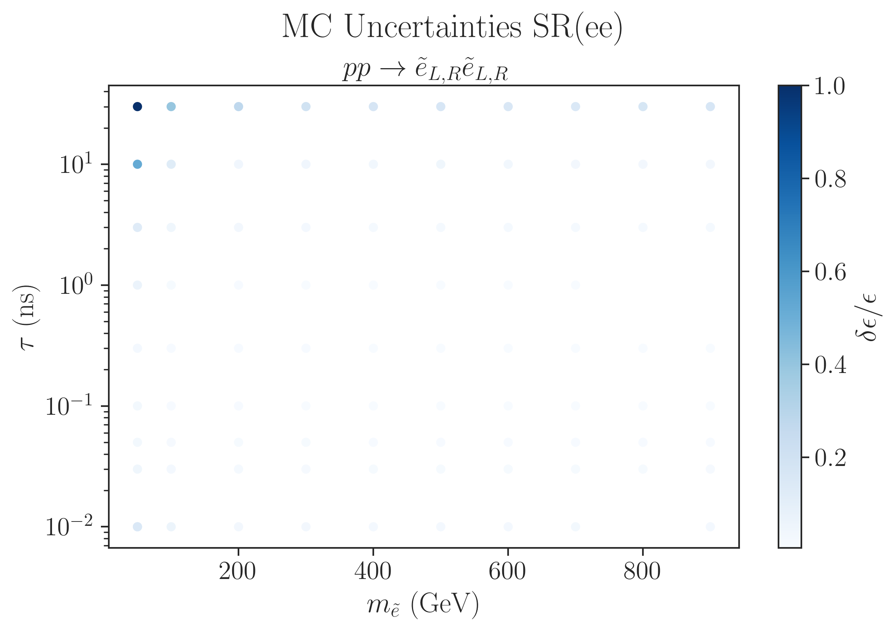
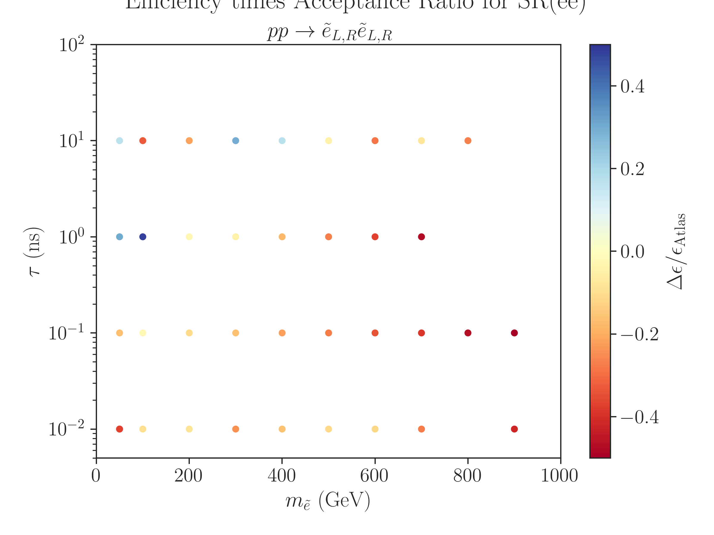
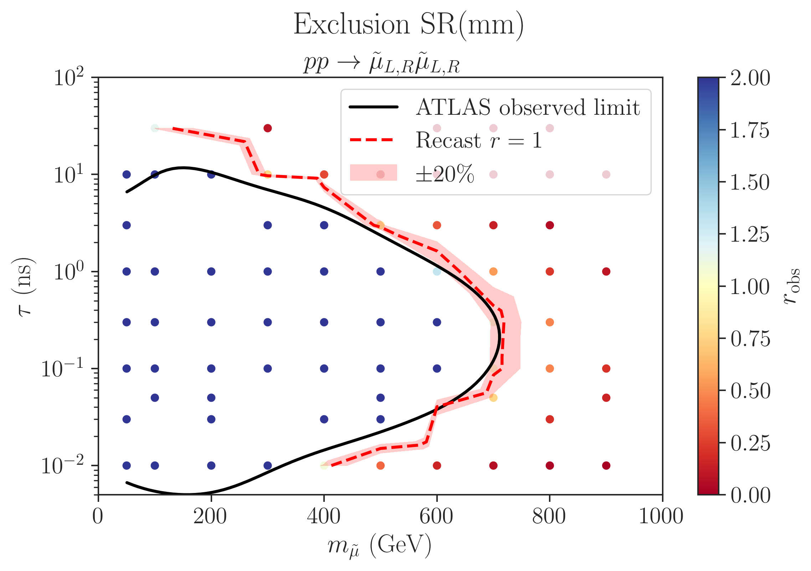
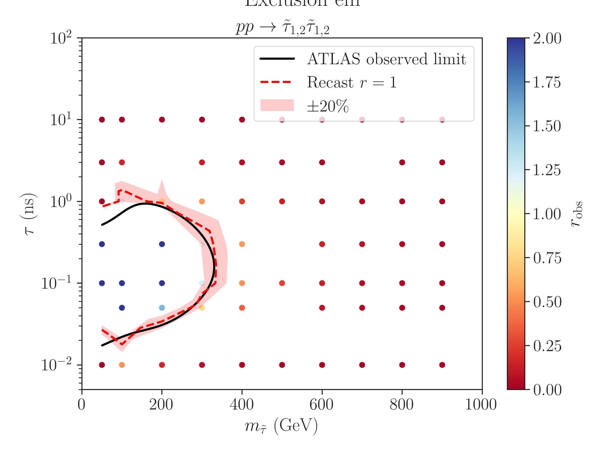

# Validation

The results for the slepton scenario used for validating the recasting code can be found in the files:
* [atlas_susy_2018_14_ee_scan.json](atlas_susy_2018_14_ee_scan.json): overall search efficiencies for selectron pair production
* [atlas_susy_2018_14_mm_scan.json](atlas_susy_2018_14_mm_scan.json): overall search efficiencies for smuon pair production
* [atlas_susy_2018_14_em_scan.json](atlas_susy_2018_14_em_scan.json): overall search efficiencies for stau pair production


## Computing efficiencies

The selectron efficiencies can be reproduced through the following steps:

1. Generate events running (in the top folder):
   ```
   ./runScanMG5.py -p validation/scan_parameters_ee.ini
   ```
      
   The events (Delphes/ROOT files) will be stored in the folders defined in the .ini file (e.g. `pp2selsel_scan` for the selectron scan) for several slepton masses and lifetimes.
   The cards for the event generation ([Cards](./Cards)) and other options for event generation are defined in the `scan_parameters_xx.ini` files.

2. Compute efficiencies running:
   ```
   ./computeEfficiencies.py -i pp2selsel_scan -l 1000011
   ```
   for the selectron scan. The PDG value passed through the `-l` flag is only used to extract model input parameters (for convenience), but does not affect the efficiencies.
   
   The final efficiencies are stored in .json files in the event folders.

3. Collect the results running:
   ```
   ./collectData.py -i pp2selsel_scan -o atlas_susy_2018_14_ee_scan.json
   ```
   
   The combined efficiencies are finally stored in the `atlas_susy_2018_14_ee_scan.json`.

For the smuon and stau scenarios the same steps can be taken with minimal changes.


## Plotting the exclusion curve

After computing the efficiencies the Jupyter notebook [plotEffs_ee.ipynb](plotEffs_ee.ipynb) shows an example of how to
analyse them. For instance the MC uncertainties (using $`\sim`$ 25k events) are shown below[^1]:




The same notebook also shows how to compare the official ATLAS efficiencies and the ones obtained from recasting.
We show below an example for the selectron simplified model:




Finally the same notebook shows how to compute the exclusion curve (note that `computeEfficiencies.py` must have been run without the `--noUL` flag, so the upper limits are also computed and stored in the .json output).
Below is a comparison between the exclusion curve obtained for the selectron, smuon and stau scenarios using the recasting code and the official ATLAS exclusion.







[^1]: The efficiencies for very small lifetime suffers from large uncertainties.
For such small lifetimes the sleptons only decay within the tracker if they have a large boost (or large pT).
Therefore only the tail of the pT distribution produces sizeable efficiencies, thus resulting in large uncertainties.
