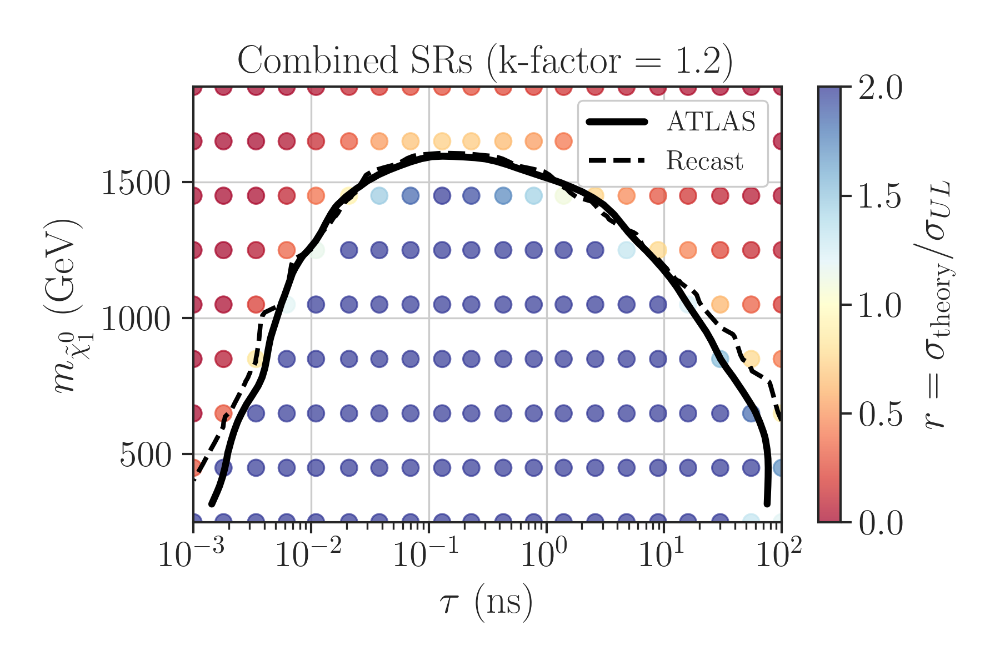
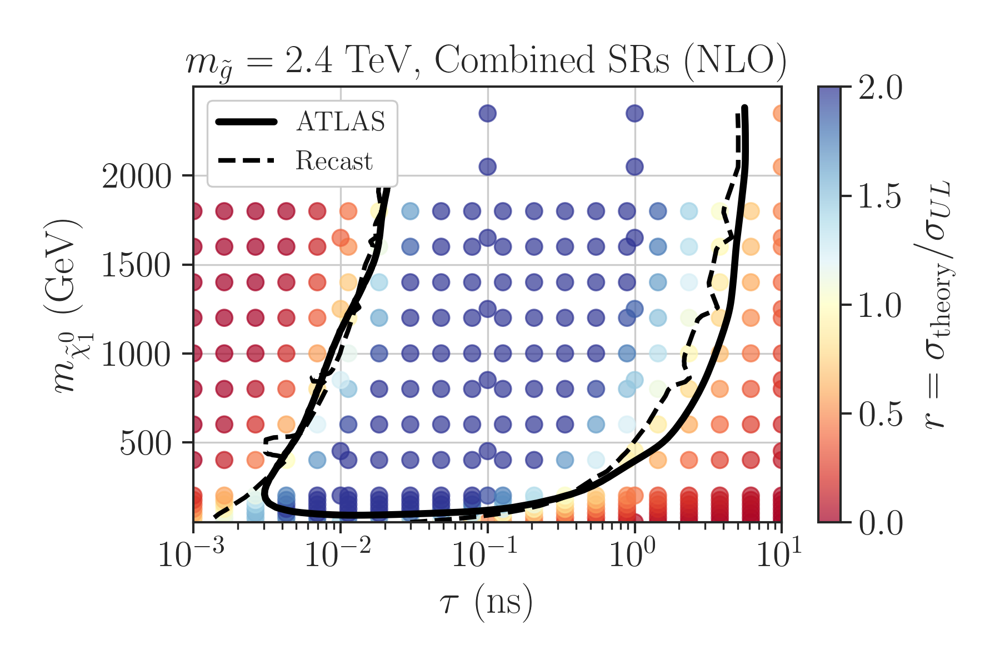
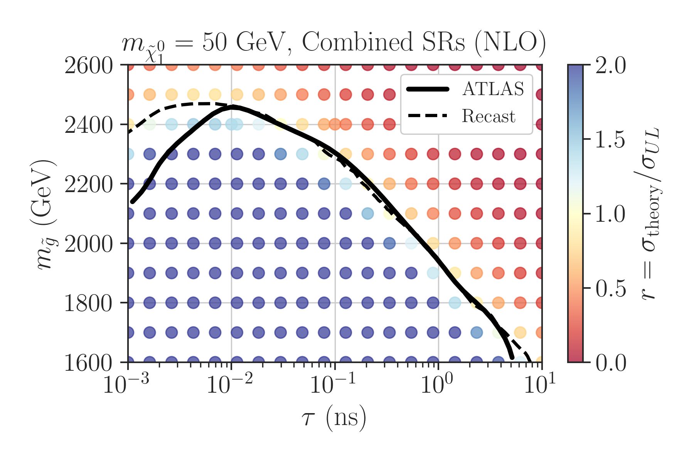

# Displaced Vertex Recasting #

## Authors: ##
[Andre Lessa](mailto:andre.lessa@ufabc.edu.br)

This repository holds the main code for recasting the 13 TeV ATLAS search for displaced vertices
and multiple jets ([ATLAS-SUSY-2018-13](https://atlas.web.cern.ch/Atlas/GROUPS/PHYSICS/PAPERS/SUSY-2018-13/))
using the efficiency grids  for event and vertex reconstruction selection provided [here](https://atlas.web.cern.ch/Atlas/GROUPS/PHYSICS/PAPERS/SUSY-2018-13/hepdata_info.pdf).


**Note: the recasting does not reproduce well the results for the strong benchmark for lifetimes smaller than 0.01 ns.**

## Pre-Requisites ##

The following pre-requisites must be installed before compiling the main code:

  * [MadGraph5](https://launchpad.net/mg5amcnlo/)
  * [Modified Delphes](./DelphesLLP.tar.gz)
  * [Pythia8](https://pythia.org/)

## Installation ##

Running:

```
./installer.sh
```

Should install most of the relevant packages.
The LHAPDF, Pythia8 and Delphes directories must be included in the library and root include paths.
This can be done running:

```
source setenv.sh
```
## Running ##

The recasting accepts ROOT files generated by the modified Delphes version provided in this repository.
Examples of Delphes cards can be found in the [validation/Cards](./validation/Cards) folder.
*Note that the LLP PDG ids have to be defined in the BSMFilter block of the delphes card, so the required
LLP information is stored in the ROOT file*.
The main recasting code accepts the following options:

```
usage: atlas_susy_2018_13_Recast.py [-h] -f INPUTFILE [INPUTFILE ...] [-o OUTPUTFILE] [-A] [-m MODEL] [-U] [-v VERBOSE]

Run the recasting for ATLAS-SUSY-2018-13 using one or multiple Delphes ROOT files as input. If multiple files are given as argument, add them (the samples weights will be normalized if -n is given).
Store the cutflow and SR bins in a pickle (Pandas DataFrame) file.

options:
  -h, --help            show this help message and exit
  -f INPUTFILE [INPUTFILE ...], --inputFile INPUTFILE [INPUTFILE ...]
                        path to the ROOT event file(s) generated by Delphes.
  -o OUTPUTFILE, --outputFile OUTPUTFILE
                        path to output file storing the DataFrame with the recasting data. If not defined, will use the name of the first input file
  -A, --add             If set, the input files will be considered to refer to samples of the orthogonal processes and their weights will be added.
  -m MODEL, --model MODEL
                        Defines which model should be considered for extracting model parameters (strong,ewk,gluino,sbottom).
  -U, --update          If the flag is set only the model points containing data newer than the dataframe will be read.
  -v VERBOSE, --verbose VERBOSE
                        verbose level (debug, info, warning or error). Default is info
```
where model is used to fetch the relevant model parameters depending on the scenario (ewk or strong production).
This information is used only for conveniently storing the model parameters (such as the proper lifetime) along with the recasting info.
The user can easily modify the [helper.py](./helper.py) code for other models.


The basic required input is a Delphes ROOT file.
For instance, running:

```
./atlas_susy_2018_13_Recast.py -f <root file>
```
will produce a pickle file containing a Pandas DataFrame with a simplified cutflow and the number of events in each signal region.
For a detailed cutflow the user can run [atlas_susy_2018_13_CutFlow.py](atlas_susy_2018_13_CutFlow.py) with similar options.


For combining results from multiple model points into a single DataFrame, run:

```
./atlas_susy_2018_13_CombineData.py -f <pickle file1> <pickle file2> ... -o <output file>
```

Finally, for computing upper limits:

```
./atlas_susy_2018_13_UpperLimits.py -f <pickle file>  -o <output file>
```

The result is again a DataFrame, but now including an upper limit column.


## Validation

The validation of the recasting code was done using the electroweak (Ewk) and gluino (Strong) benchmarks considered by ATLAS.

The scan over the parameter space can be conveniently done running:

```
./runScanMG5.py -p <parameters file>
```
where basic required input is defined [parameter file](./validation/scan_parameters_chargino.ini) specifying the input cards and model parameters.
The output is a Delphes ROOT file for each model point.

The MadGraph, Pythia and Delphes cards for each scenario can be found in [./validation/Cards](./validation/Cards/).
The recasting results and plotting scripts can be found in the folders: [ewk_results](./validation/ewk_results) and [strong_results](./validation/stong_results).

## Validation ##

### Electroweak Scenario

A comparison between the official ATLAS exclusion curve and the one
obtained by this recasting code is shown below:



The results combine both signal regions (High PT and Trackless) assuming they are fully uncorrelated.

### Strong Scenario

A comparison between the official ATLAS exclusion curves and the ones
obtained by this recasting code are shown below:





The results combine both signal regions (High PT and Trackless) assuming they are fully uncorrelated.


[^1]: A modified version of Delphes needs to be installed, which includes a module for filtering LLPs
      and storing their decays.  


