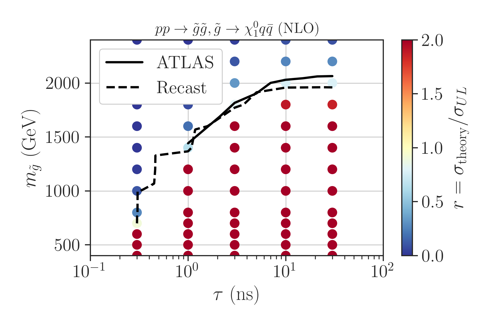

# HSCP Recasting #

## Authors: ##
[Andre Lessa](mailto:andre.lessa@ufabc.edu.br)

This repository holds the main code for recasting the 13 TeV ATLAS heavy stable charged particle
search ([ATLAS-SUSY-2018-42](http://atlas.web.cern.ch/Atlas/GROUPS/PHYSICS/PAPERS/SUSY-2018-42/))
based on the recasting details provided [here](http://atlas.web.cern.ch/Atlas/GROUPS/PHYSICS/PAPERS/SUSY-2018-42/hepdata_info.pdf).


**Note that the recasting is only possible for the inclusive (discovery) signal regions, hence the sensitivity of the recast is smaller than the ATLAS limit setting signal regions. As a result the excluded regions for the benchmarks scenarios are smaller than the official ATLAS results**

## Pre-Requisites and Installation ##

The following pre-requisites must be installed before compiling the main code:

  * [MadGraph5](https://launchpad.net/mg5amcnlo/)
  * [Delphes](https://cp3.irmp.ucl.ac.be/projects/delphes)[^1]
  * [Pythia8](https://pythia.org/)
  * [HepMC](http://hepmc.web.cern.ch/hepmc/)

Running:

```
./installer.sh
```

Will try to fetch the required packages and install them in the current folder.
*Note that a modified version of Delphes should be installed using [../../Delphes_LLP/DelphesLLP.tar.gz](../../Delphes_LLP/DelphesLLP.tar.gz)*
The LHAPDF, Pythia8 and Delphes directories must be included in the library and root include paths.
This can be done running:

```
source setenv.sh
```

## Running ##

The recasting is based on the Delphes output generated by running MadGraph/Pythia/Delphes.
Note that the Delphes card must define the PDG codes for the LLPs in the LLPFilter block, so the relevant information is stored in the Delphes output. An example can be found [here](./validation/Cards/chargino/delphes_card_chargino).


The event yields and recasting info can then be obtained running:

```
./atlas_susy_2018_42_Recast.py -f <input ROOT file> -o <output file> -m <model>
```

where model is used to fetch the relevant model parameters depending on the scenario (stau, wino or gluino).
This information is used only for conveniently storing the model parameters (such as the proper lifetime) along with the recasting info.
The user can easily modify the [helper.py](./helper.py) code for other models.
The output is a pickle file containing a Pandas DataFrame with the model parameters and recasting output.


For combining results from multiple model points into a single DataFrame, run:

```
./atlas_susy_2018_42_CombineData.py -f <pickle file1> <pickle file2> ... -o <output file>
```

Finally, for computing upper limits:

```
./atlas_susy_2018_42_UpperLimits.py -f <pickle file>  -o <output file>
```

The result is again a DataFrame, but now including an upper limit column.


## Validation

The validation of the recasting code was done using the Wino (Chargino), Stau and Gluino benchmarks considered by ATLAS.

The scan over the parameter space can be conveniently done running:

```
./runScanMG5.py -p <parameters file>
```
where basic required input is defined [parameter file](./validation/scan_parameters_chargino.ini) specifying the input cards and model parameters.
The output is a Delphes ROOT file for each model point.

The MadGraph, Pythia and Delphes cards for each scenario can be found in [./validation/Cards](./validation/Cards/).
The recasting results and plotting scripts can be found in the folders: [chargino_results](./validation/chargino_results), [stau_results](./validation/stau_results) and [gluino_results](./validation/gluino_results).

## Validation ##

### Wino Scenario

A comparison between the official ATLAS cut-flow for the wino scenario with mass 1.3 TeV and lifetime 10 ns is shown below:

|                                                | Recast (ATLAS) |
|:-----------------------------------------------|:---------------|
| m(chargino) (GeV)                              | 1300.0         |
| tau (ns)                                       | 10             |
| Total                                          | 1.000 (1.000)  |
| Event and jet Cleaning                         | ----- (0.995)  |
| Trigger                                        | 0.557 (0.539)  |
| Primary vertex                                 | ----- (0.539)  |
| $E_{T}^{miss}>170$ GeV                         | 0.383 (0.381)  |
| Track in PV                                    | ----- (0.378)  |
| $p_{T} > 50$ GeV                               | ----- (0.326)  |
| Track quality requirements                     | ----- (0.279)  |
| Track isolation                                | ----- (0.244)  |
| $p_{T} > 120$ GeV                              | 0.264 (0.242)  |
| Track momentum uncertainty                     | ----- (0.231)  |
| $\eta < 1.8$                                   | 0.245 (0.211)  |
| $m_{T}({track},{p}_{{T}}^{{ miss}}) > 130$ GeV | ----- (0.183)  |
| Electron veto                                  | ----- (0.183)  |
| Hadron/tau veto                                | ----- (0.183)  |
| (SR-Low - no mass Window)                      | 0.034 (0.039)  |
| (SR-High - no mass Window)                     | 0.091 (0.092)  |

A comparison between the official ATLAS 95\% C.L. exclusion curve for the wino scenario and the one obtained using this recasting code is shown below:


Validation of the acceptances and efficiencies for all the benchmark points can be found in [this notebook](./validation/chargino_results/validation_CharginoTables.ipynb)

### Stau Scenario

A comparison between the official ATLAS 95\% C.L. exclusion curve for the stau scenario and the one obtained using this recasting code is shown below:


Validation of the acceptances and efficiencies for all the benchmark points can be found in [this notebook](./validation/stau_results/validation_StauTables.ipynb)


### Gluino Scenario


A comparison between the official ATLAS 95\% C.L. exclusion curve for the gluino scenario and the one obtained using this recasting code is shown below:





Validation of the acceptances and efficiencies for all the benchmark points can be found in [this notebook](./validation/gluino_results/validation_GluinoTables.ipynb)


[^1]: A modified version of Delphes needs to be installed, which includes a module for filtering LLPs
      and storing their decays.  


